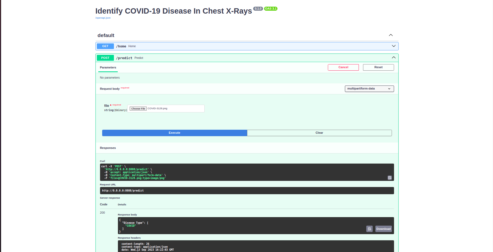

# Identifying-COVID-19-Diseases-In-Chest-X-Rays

<p align="center">
  
</p>

## Table Content
- [Datasets](#datasets)
- [Getting Started](#getting-started)
- [Author](#author)

## Datasets
## Getting Started
Follow theses steps to set up the environment and run the application.
1. Fork the repository [here](https://github.com/ldebele/Identifying-COVID-19-Diseases-In-Chest-X-Rays.git).
2. Clone the forked repository.
    ```bash
    git clone https://github.com/<YOUR-USERNAME>/Identifying-COVID-19-Diseases-In-Chest-X-Rays.git
    cd Identifying-COVID-19-Diseases-In-Chest-X-Rays.git
    ```
3. Run the application.
    ```bash
    docker-compose up
    ```
## Author
- `Lemi Debela`